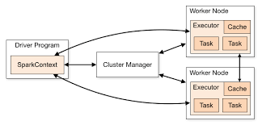
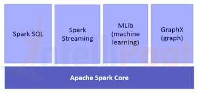

# Apache Spark with Scala
Based on the material by Frank Kane, Sundog Education.

### Directory structure
```
.
├── LICENSE
├── README.md
├── build.sbt
├── project
├── res
├── src
└── target
```

- **build.sbt** - The primary build definition file for SBT (Scala Build Tool). It specifies project dependencies, settings, and build instructions.
- `project/` - Contains SBT project configuration files and subfolders used for managing the build process.
  - build.properties - defines the SBT version to use for building the project.
- `res/` - A resource directory containing data sources used as input for Spark jobs and exercises. Available at: https://www.sundog-education.com/sparkscala/
- `scr/` - Source code directory.
  - `main/` - the main application source code.
  - `scala-refresher/` -  Scala refresher scripts or exercises.
- `target/` - Build output directory generated locally by SBT, containing compiled classes, intermediate files, and logs. Excluded from the remote by .gitignore.

### Setting up local environment
1. Verify that IntelliJ and Java 11 are installed.
2. Configure the project SDK in IntelliJ to use jdk-11.
3. Install the Scala plugin for IntelliJ.
2. Validate the `build.sbt`.
3. Mark `scr/main` as root directory.

# About Spark

**Spark** is a fast and general engine for large data processing. It parallelizes processing and is highly scalable.

It is faster than map reduce (Hadoop) due to the **DAG engine** (directed acyclic graph). It optimizes the workflow and is memory-based.

### Spark architecture




### Components of Spark



- **Spark Core** - core Spark functionality, for example, RDDs.
- **Spark SQL** - to integrate Spark through SQL commands. Treats Spark as a giant distributed database.
- **MLLib** - distributed machine learning on massive datasets.
- **Spark Streaming** - ingesting data in near real-time.
- **GraphX** - graphs for computer science.

Spark can be written in Python, Java, and Scala.

**Benefits of using Scala:**
- Spark itself is written in Scala.
- Scala's functional programming model is a good fit for distributed processing.
- It gives fast performance (Scala compiles to Java bytecode).
- Less code boilerplate than Java.
- Faster than Python.

## Spark RDD

**Resilient Distributed Dataset (RDD)** is a core Spark functionality.

Before creating an RDD, a Spark context must be created, which is done by the driver program. The Spark shell creates the .sc object. Then, data can be loaded to create an RDD.

Examples:
- [FriendsByAge](https://github.com/nataliaarhus/spark/blob/main/src/main/FriendsByAge.scala)
- [MinTemperatures](https://github.com/nataliaarhus/spark/blob/main/src/main/MinTemperatures.scala)
- [RatingsCounter](https://github.com/nataliaarhus/spark/blob/main/src/main/RatingsCounter.scala)
- [SpentByCustomer](https://github.com/nataliaarhus/spark/blob/main/src/main/SpentByCustomer.scala)
- [WordCount](https://github.com/nataliaarhus/spark/blob/main/src/main/WordCount.scala)

## Spark SQL

**Spark SQL** is a more modern and useful A{O built on top of RDDs.

To use Spark SQL in Scala, a SparkSession needs to be created (instead of a SparkContext in case of RDDs). SparkContext can be taken from the session and used to pass SQL queries on Datasets. The session should be stopped when processing is completed.

**DataFrame:**
- An extended RDD, also described as a dataset of Row objects.
- Contains row objects.
- Has a schema (more efficient storage than RDD).
- Can run SQL queries.
- Can communicate with db-like tools.

**DataSet:**
- It knows the schema at compile time.
- Can explicitly wrap a given struct or type (Dataset[Person]).
- It can only be used in languages that compile, i.e. Scala and Java but not Python.
- RDDs can be converted to DataSets with .toDS().

**Case Class** - in Scala, it's a compact way of defining an object. This way, the dataset schema is defined.

**Broadcast variables** - allows to create an object (eg. a map) and forward it to every executor on the cluster which can be used as needed. 

Examples:
- [FriendsByAgeDataset](https://github.com/nataliaarhus/spark/blob/main/src/main/FriendsByAgeDataset.scala)
- [MinTemperaturesDataset](https://github.com/nataliaarhus/spark/blob/main/src/main/MinTemperaturesDataset.scala)
- [MostPopularSuperheroDataset](https://github.com/nataliaarhus/spark/blob/main/src/main/MostPopularSuperheroDataset.scala)
- [PopularMoviesDataset](https://github.com/nataliaarhus/spark/blob/main/src/main/PopularMoviesDataset.scala)
- [PopularMoviesBroadcast](https://github.com/nataliaarhus/spark/blob/main/src/main/PopularMoviesBroadcast.scala)
- [WordCountDataset](https://github.com/nataliaarhus/spark/blob/main/src/main/WordCountDataset.scala)


## Spark ML

## Spark Streaming

